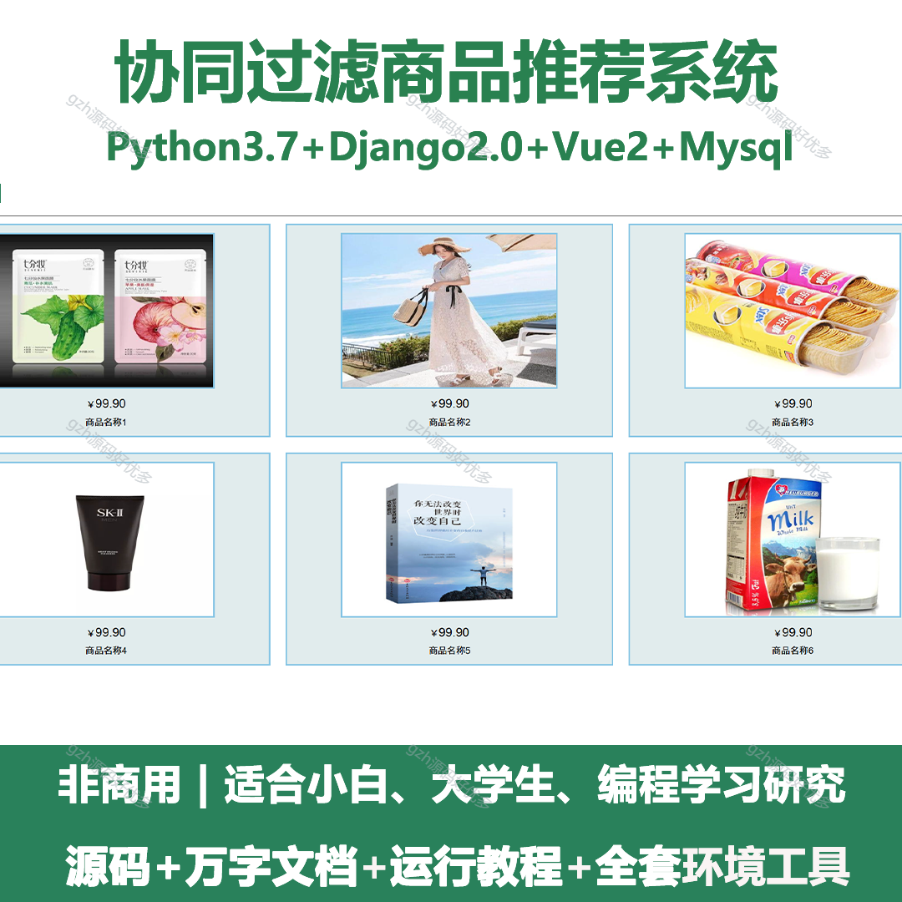
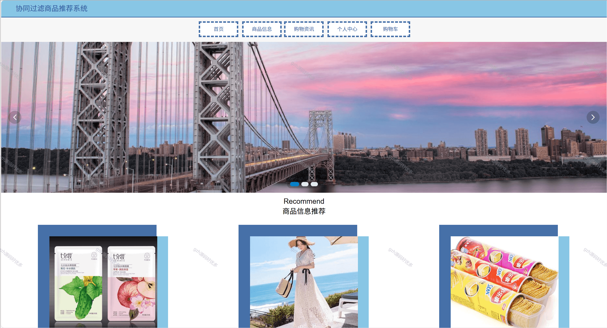
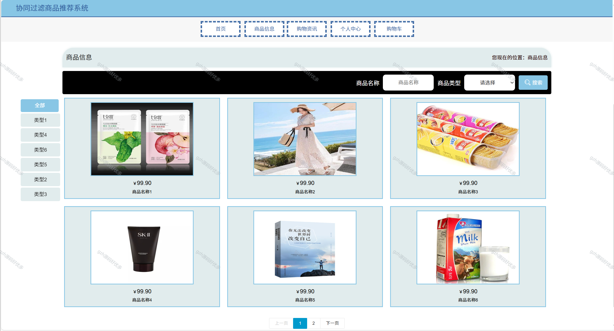
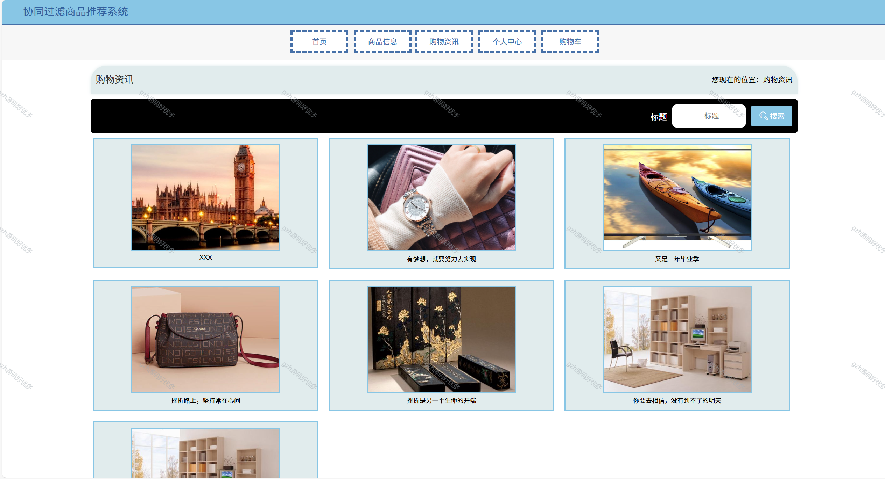
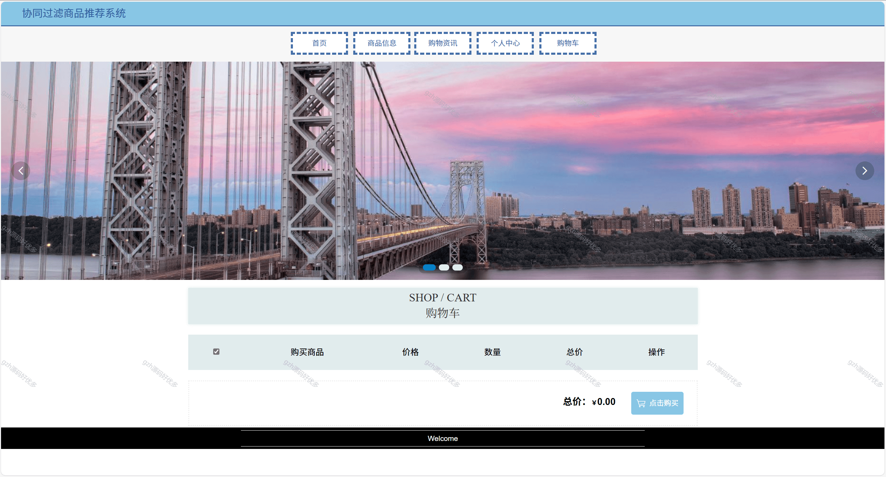
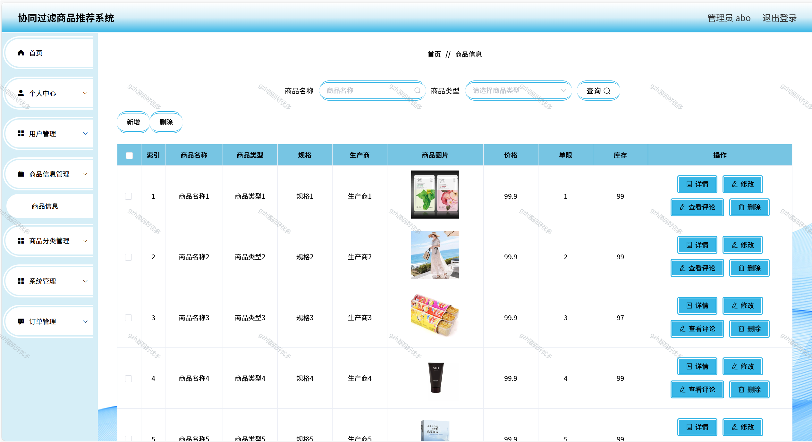
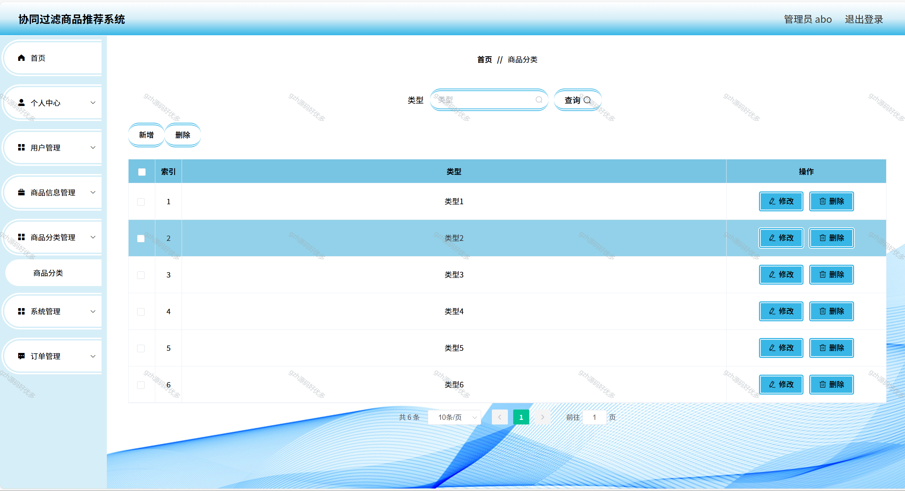
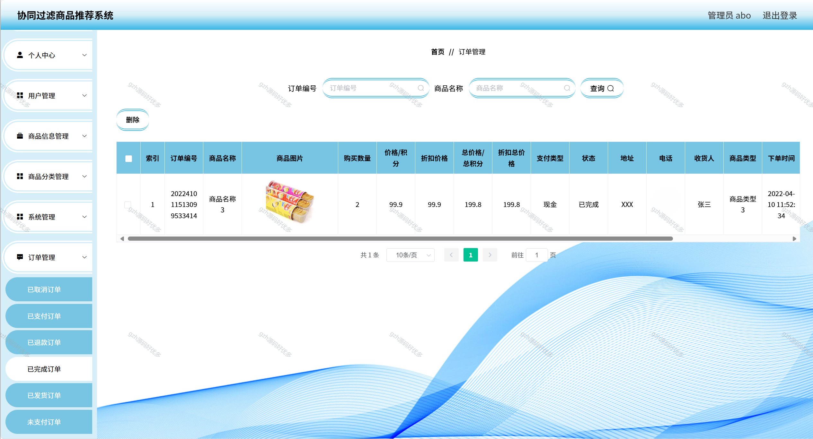
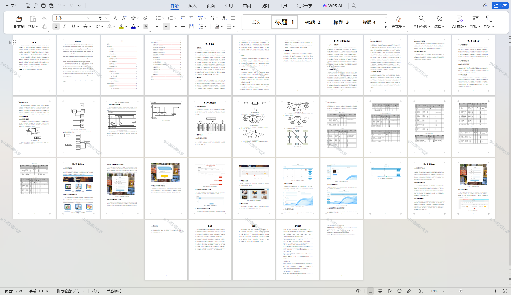

# python054
python054基于Python+Django的协同过滤商品推荐系统
 
## 查看主页获取源码

### 一、关键词
协同筛选商品推荐系统，协同式商品推荐系统，协作筛选商品推荐系统

### 二、作品包含
源码+数据库+万字文档+全套环境和工具资源+本地部署教程

### 三、项目技术
前端技术：Vue2.0、Element-ui、Layui
后端技术：Python3.7、Django2.0

### 四、运行环境（以下版本亲测，其他版本未知，请自测）
开发工具：PyCharm + VSCODE

数据库：MySQL5.7（最低要5.7版本）

数据库管理工具：Navicat10+

Python：Python3.7

前端Nodejs：14

浏览器：谷歌浏览器

### 五、项目介绍
项目编号：python054

系统的设计的有管理员和用户两种权限，用户可以通过本网站查看推荐的商品，然后可以加入购物车进行购买，订单完成后可以进行评价，而管理员可以直接通过本平台上传自己的商品信息，收到用户的订单以后可以及时的安排发货，可以很好的节省人工方面的开支，而且还能带来很高的营业额，提高工作效率。

### 六、运行截图

